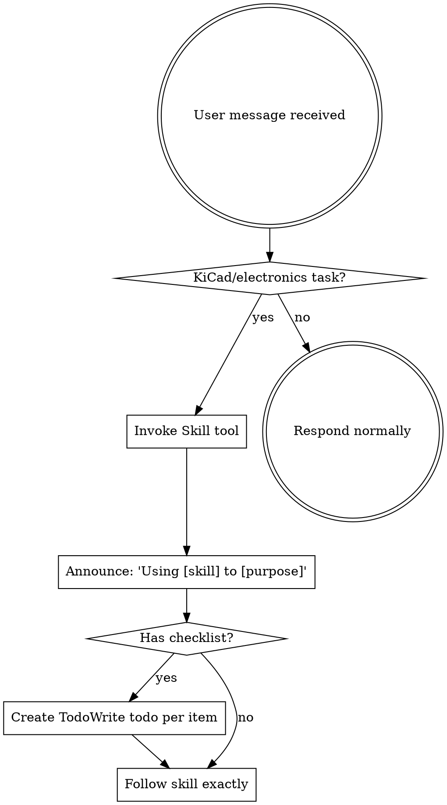

<CRITICAL-RULE>
NEVER use the Read, Write, or Edit tools on KiCad files (.kicad_sch,
.kicad_pcb, .kicad_sym, .kicad_mod, .kicad_pro, .kicad_prl). ALL
KiCad file manipulation MUST go through the kicad MCP tools. NEVER
run kicad-cli commands via Bash. If an MCP tool returns an error, try
different parameters — do NOT fall back to manual file editing.

EVERY KiCad operation has a corresponding MCP tool. Do NOT claim a
tool does not exist without first listing all available tools. Key
tools that MUST be used instead of file writes:
- `add_symbol` — create custom symbol definitions in .kicad_sym files
- `create_symbol_library` — create new .kicad_sym library files
- `create_schematic` — create new .kicad_sch files
- `create_project` — create new .kicad_pro project files
If you find yourself thinking "there's no MCP tool for this," you are
wrong. Check the tool list again.
</CRITICAL-RULE>

<SUBAGENT-STOP>
If you were dispatched as a subagent to execute a specific task, skip this skill.
</SUBAGENT-STOP>

<EXTREMELY-IMPORTANT>
When working on ANY electronics or KiCad task, you MUST follow this
pipeline. Do not place components, route traces, run checks, or select
parts without first completing prior phases and their gates.

This is not optional. Do not rationalize skipping it.
</EXTREMELY-IMPORTANT>

## Skill Activation Flow



When a skill contains a checklist (items with `- [ ]`), you MUST create a TodoWrite entry for each item BEFORE starting work. This provides visible progress tracking throughout the design session.

# KiCad Design Pipeline

This plugin enforces a validated pipeline for electronics design.
Every phase produces evidence before the next phase can start.

## Pipeline

```
circuit-design ---- requirements -> validated BOM artifact
    |
    |  EXIT GATE: resolve all lib_ids + footprints, write specs/bom.md
    |  BOM reviewer subagent validates artifact
    |  HARD GATE: user approves BOM
    |
    v
schematic-plan ---- BOM -> placement & wiring plan artifact
    |
    |  Reads specs/bom.md
    |  Produces specs/schematic-plan.md with exact coordinates
    |  Schematic plan reviewer subagent validates artifact
    |  HARD GATE: user approves plan
    |
    v
schematic-design -- plan -> mechanical execution
    |
    |  Reads specs/schematic-plan.md, executes mechanically
    |  EXIT GATE: run ERC, must be zero violations
    |
    v
verification ------ ERC gate (blocks PCB until clean)
    |
    |  HARD GATE: ERC = 0 violations
    |
    v
pcb-layout -------- netlist -> board layout
    |
    |  PRE-FLIGHT: verify all footprints exist
    |  EXIT GATE: run DRC, must be zero violations
    |
    v
verification ------ DRC gate (blocks export until clean)
    |
    |  HARD GATE: DRC = 0 violations
    |
    v
Export ------------- Gerbers, drill, BOM, pick-and-place, 3D,
                    fabrication notes, assembly drawing
```

## Phase Gates

<HARD-GATE>
Do NOT proceed to schematic-plan until specs/bom.md exists AND its
reviewer has returned APPROVED AND the user has confirmed approval.
</HARD-GATE>

<HARD-GATE>
Do NOT proceed to schematic-design until specs/schematic-plan.md
exists AND its reviewer has returned APPROVED AND the user has
confirmed approval.
</HARD-GATE>

<HARD-GATE>
Do NOT proceed to pcb-layout until run_erc output shows
violation_count = 0. "Probably clean" is not evidence.
</HARD-GATE>

<HARD-GATE>
Do NOT proceed to export until run_drc output shows
violation_count = 0. "Probably clean" is not evidence.
</HARD-GATE>

**What constitutes "user approval":** The user explicitly says
something like "approved," "looks good," "proceed," "yes," or "go
ahead." Asking a question or requesting changes is NOT approval.

## Skill Catalog

| Skill | Invoke as | When to use |
|-------|-----------|-------------|
| **circuit-design** | `/kicad:circuit-design` | Choosing topology, selecting components, calculating values, creating a validated BOM |
| **schematic-plan** | `/kicad:schematic-plan` | Planning exact placement coordinates and wiring from a validated BOM |
| **schematic-design** | `/kicad:schematic-design` | Executing a placement plan OR modifying an existing schematic |
| **pcb-layout** | `/kicad:pcb-layout` | Placing footprints on a PCB, routing traces, adding vias and copper zones |
| **verification** | `/kicad:verification` | Running ERC/DRC, fixing violations, preparing for manufacturing export |

## Entry Points — Every Path Validates

- **New design from scratch:** Start at circuit-design, full pipeline.
- **User provides their own BOM:** Circuit-design runs in
  validation-only mode — resolves every lib_id and footprint, fills
  in missing fields, writes specs/bom.md, runs the BOM reviewer.
  Skips topology selection but does NOT skip validation. The user's
  BOM is accepted, then audited.
- **User provides a placement plan:** The plan is written to
  specs/schematic-plan.md, then the schematic plan reviewer is
  dispatched. The user's plan is accepted, then audited. If the
  reviewer finds issues (wrong lib_ids, coordinates outside page
  bounds, incorrect pin names), they are surfaced and must be
  resolved before execution.
- **Modifying existing schematic:** Enter at schematic-design in
  modification mode. Lightweight pre-flight validates lib_ids for
  any new components via `list_lib_symbols` before placement.
- **Running checks on existing work:** Enter at verification directly.

## Anti-Patterns for Electronics Design

| Anti-Pattern | Why It Fails |
|-------------|-------------|
| "I know this IC's pinout from memory" | You're recalling training data, not the library. Call `get_symbol_info`. |
| "The datasheet app circuit is simple enough to place without planning" | That's exactly what produced 9 wasted tool calls in previous failures. |
| "Standard 100nF decoupling is fine" | The datasheet specifies the cap value and ESR. Check the datasheet. |
| "This symbol name is probably right" | `Q_PMOS_GSD` sounded right. It doesn't exist. Call `list_lib_symbols` and verify. |
| "A4 is big enough, I'll check later" | Later = after 4 failed placements. Calculate first. |
| "These nets are obvious, I don't need to plan the wiring" | Obvious to you means hallucinated pin names. Query the library. |
| "I'll just use the same component I used last time" | Training data bias. The library may have been updated. Verify. |

## Rationalization Prevention

| Thought | Reality |
|---------|---------|
| "I already know the components, skip circuit-design" | You'll hallucinate lib_ids. Do the phase. |
| "The plan is simple enough to do in my head" | That's what caused 9 wasted tool calls last time. Write the plan. |
| "I'll just fix the page size when it fails" | Pre-calculate it. Reactive fixes waste tokens. |
| "ERC will probably pass, start PCB layout" | Run ERC. "Probably" is not evidence. |
| "This is just a small change, no need for the full pipeline" | Small changes use modification mode. But modification mode still validates lib_ids. |
| "The user already validated this, skip the reviewer" | The reviewer checks what humans miss — pin names, coordinate math, spacing. Always run it. |

## What This Plugin Provides

The KiCad MCP server gives you tools to drive KiCad programmatically.
You do not need the user to click anything in KiCad — the tools do it
for you. Tool groups (60 tools total):

- **Project:** `create_project`, `create_schematic`,
  `create_symbol_library`, `create_sym_lib_table`,
  `add_hierarchical_sheet`, `run_jobset`, `get_version`
- **Symbol Authoring:** `add_symbol` (create custom symbol
  definitions), `list_lib_symbols`, `get_symbol_info`,
  `export_symbol_svg`, `upgrade_symbol_lib`
- **Schematic — Place & Edit:** `place_component`, `move_component`,
  `remove_component`, `set_component_property`, `set_page_size`,
  `add_lib_symbol`
- **Schematic — Wiring:** `connect_pins`, `wire_pins_to_net`,
  `add_wires`, `add_label`, `add_global_label`, `add_junctions`,
  `no_connect_pin`, `remove_label`, `remove_wire`, `remove_junction`
- **Schematic — Power:** `add_power_symbol`,
  `auto_place_decoupling_cap`
- **Schematic — Inspect:** `list_schematic_items`, `get_symbol_pins`,
  `get_pin_positions`, `get_net_connections`,
  `list_unconnected_pins`, `add_text`
- **Schematic — Export:** `run_erc`, `export_schematic`,
  `export_netlist`, `export_bom`
- **PCB — Place & Edit:** `place_footprint`, `move_footprint`,
  `remove_footprint`
- **PCB — Route:** `add_trace`, `add_via`
- **PCB — Draw:** `add_pcb_text`, `add_pcb_line`
- **PCB — Inspect:** `list_pcb_items`, `get_board_info`,
  `get_footprint_pads`
- **PCB — Export:** `run_drc`, `export_pcb`, `export_gerbers`,
  `export_3d`, `export_positions`, `export_ipc2581`
- **Footprint Libraries:** `list_lib_footprints`,
  `get_footprint_info`, `export_footprint_svg`,
  `upgrade_footprint_lib`

Always invoke the matching skill for conventions, spacing, and
strategy before using these tools.
